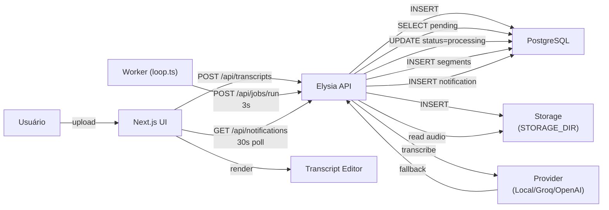

# DESIGN.md — Transcripts SaaS

**Last Updated:** 2026-05-14  
**Status:** Active (Implemented)  
**Format:** Design Doc (getdesign.md)

---

## Context

**What exists today:**
- SaaS de transcrição de mídia (áudio/vídeo) com dashboard web
- Upload → processamento assíncrono → transcrição editável com segmentos sincronizados por timestamp
- Stack: Next.js 16 (App Router) + Elysia HTTP + PostgreSQL 16 + Drizzle ORM
- Worker Bun stateless que puxa jobs via HTTP polling (3s interval)
- 3 provedores Whisper (local Faster-Whisper Python, Groq API, OpenAI API) com fallback automático
- UI dark-first com ShadCN/UI (new-york), Tailwind v4, Framer Motion transitions
- 4 docker-compose variantes (padrão, local-dev, easypanel, coolify-vps)
- Export multi-formato (TXT, HTML, DOCX) com SHA-256 hash de mídia
- Role-based access (6-tier hierarchy: super_admin > admin > pro > viewer)

**Constraints:**
- Sem fila externa (Redis/Bull) — polling HTTP suficiente
- Processamento síncrono por job (não streaming real-time)
- Idioma fixo: português (pt-BR)
- Docker-friendly deployment

**Stakeholders:**
- Usuários finais (upload, edição, compartilhamento, export)
- Administradores (gerenciar usuários, roles, permissões)
- Sistema (processamento, retry, fallback)

---

## Problem

**Core challenges resolved by this design:**

1. **Race condition em claim de jobs** — múltiplos workers simultâneos devem processar jobs sem duplicação ou conflito
2. **Idempotência em retry** — se worker cai mid-transcription, retry não deve gerar segmentos duplicados
3. **Resiliência de provider** — provedores API falham (rate limits, indisponibilidade); precisamos fallback automático
4. **Escalabilidade sem fila externa** — suportar N workers sem Redis, SQS, ou infraestrutura distribuída
5. **Controle de acesso granular** — hierarquia T6 com regras complexas (tier-based, ownership-based, peer-based)
6. **Export fidelidade** — preservar segments, timestamps, análise, metadata, hash de mídia em múltiplos formatos

---

## Goals & Non-Goals

### ✅ Goals
- Processar jobs atomicamente (UPDATE … RETURNING) sem lock distribuído
- Suportar fallback entre provedores Whisper com retry inteligente (3 tentativas)
- Escalar horizontalmente (múltiplos workers, polling HTTP, claim em DB)
- Exportar em 4 formatos (TXT, HTML, DOCX, DOC) com fidelidade 100%
- Aplicar modelo T6 (6-tier) com validação em cada operação sensível
- Manter auditabilidade (hash SHA-256 de mídia, user roles, timestamps)

### ❌ Non-Goals
- Suporte para OCR, reconhecimento facial, ou edição de áudio
- Transcrição real-time (streaming WebSocket)
- Sincronização com drives externos (Google Drive, Dropbox)
- Sistema de fila dedicado (Redis, SQS, Temporal)

---

## Proposed Design

### 1. Claim Atômico com UPDATE … RETURNING

**Arquivo:** `src/server/services/jobs.ts:runPendingJobs(limit)`

**Problema:** Com N workers simultâneos, como garantir que cada job é processado exatamente uma vez?

**Solução:**
```typescript
// Atomic claim: apenas a instância que consegue UPDATE ganha a lock
const [job] = await db
  .update(transcriptionJobs)
  .set({ status: "processing", pickedAt: now() })
  .where(and(
    eq(transcriptionJobs.id, jobId),
    eq(transcriptionJobs.status, "pending")
  ))
  .returning();

if (!job) {
  // Outra instância já pegou este job
  continue;
}
// Garantido: apenas eu estou processando este job
```

**Por quê:**
- `UPDATE … WHERE status='pending' RETURNING` é indivisível (database-level atomicity).
- Segundo worker vê `UPDATE` com 0 linhas afetadas (status já não é 'pending') → pula para próximo job.
- Zero deadlock, zero coordenação externa.

**Trade-off:** Se worker cai após UPDATE mas antes de salvar segmentos, job fica "processing" indefinidamente.

**Mitigação:** Worker tick que marca `failed` se `pickedAt` é > 10 min atrás (timeout).

---

### 2. Dedupe de Segmentos em Retry

**Arquivo:** `src/server/services/jobs.ts`

**Problema:** Se worker retenta após falha parcial, insere segmentos duplicados `(startMs, endMs, text)`.

**Solução:**
```typescript
// Antes de buscar segmentos do provider:
await db
  .delete(transcriptSegments)
  .where(eq(transcriptSegments.mediaId, mediaId));

// Depois inserir novos segmentos (garantido sem duplicatas)
const segments = await transcribeWithFallback(audioPath);
await db.insert(transcriptSegments).values(
  segments.map(s => ({
    mediaId,
    startMs: s.startMs,
    endMs: s.endMs,
    text: s.text,
  }))
);
```

**Por quê:** Simples, idempotente, sem complexidade (versioning, flags de soft-delete).

**Trade-off:** Reprocessa segmentos em cada retry (overhead CPU mínimo).

---

### 3. Multi-Provider Whisper com Fallback

**Arquivo:** `src/server/services/transcription.ts`

**Problema:** Provedores falham (rate limits, API down, key inválida). Sem fallback, transcrição perde.

**Solução:**
```typescript
// Interface abstrata
interface TranscriptionProvider {
  name: string;
  transcribe(path: string, lang: string): Promise<TranscriptionResult>;
  transcribeStream?(path: string, lang: string): AsyncIterable<TranscriptionSegment>;
}

// Implementações
class LocalWhisperProvider { /* Faster-Whisper via HTTP :8000 */ }
class GroqProvider { /* https://api.groq.com/openai/v1/audio/transcriptions */ }
class OpenAIProvider { /* https://api.openai.com/v1/audio/transcriptions */ }

// Fallback recursivo
async function transcribeWithFallback(
  provider: TranscriptionProvider,
  path: string,
  lang: string,
): Promise<TranscriptionResult> {
  try {
    return await provider.transcribe(path, lang);
  } catch (err) {
    const fallbackProvider = getFallbackProvider(provider.name);
    if (fallbackProvider) {
      return await transcribeWithFallback(fallbackProvider, path, lang);
    }
    throw err;
  }
}

// Seleção
function getProvider(): TranscriptionProvider {
  const primary = process.env.TRANSCRIPTION_PROVIDER || "local";
  if (primary === "local") return new LocalWhisperProvider();
  if (primary === "groq") return new GroqProvider();
  return new OpenAIProvider();
}
```

**Por quê:**
- Desacoplamento (nova provider = 1 classe nova, sem mudanças em runPendingJobs).
- Fallback automático (config: `TRANSCRIPTION_PROVIDER_FALLBACK=openai`).
- Suporte para streaming (progressivo segment insert).

---

### 4. Drizzle ORM (vs Prisma)

**Arquivo:** `src/db/schema.ts`, `drizzle/migrations/*.sql`

**Decisão:** Drizzle.

**Por quê:**
- **Type-safe runtime:** Queries validadas em build-time + runtime.
- **SQL puro:** Migrations são `.sql` versionados (auditável, portável).
- **Transações explícitas:** `db.transaction()` é opt-in, claro.
- **Batch operations:** `UPDATE … RETURNING`, `INSERT … SELECT` nativas (critical para jobs idempotentes).

**Alternativa rejeitada:** Prisma (migrations abstratas, menos controle, transações opacas).

**Trade-off:** Mais SQL manual vs menos abstrações mágicas (aceitável).

---

### 5. Elysia HTTP Embutida em Next.js

**Arquivo:** `src/server/index.ts`, `src/app/api/[...path]/route.ts`

**Decisão:** Elysia embutida via catch-all.

```typescript
// src/server/index.ts
const app = new Elysia()
  .use(auth) // JWT plugin
  .get("/health", () => ({ ok: true }))
  .post("/api/jobs/run", runPendingJobs)
  .get("/api/notifications", getNotifications)
  // ... outras rotas

export { app };

// src/app/api/[...path]/route.ts (Next.js catch-all)
import { app } from "@/server";

export async function POST(req: Request) {
  return app.handle(req);
}
export async function GET(req: Request) {
  return app.handle(req);
}
```

**Por quê:**
- Zero latência de network (Next.js → API).
- Uma process, uma pool DB.
- Deployment simples (1 container).

**Alternativa rejeitada:** Microsserviço separado (latência, 2 containers, pool DB duplicado).

**Trade-off:** Roteamento misturado (Next + Elysia) é menos separado vs microserviço dedicado.

---

### 6. Worker Stateless com HTTP Polling

**Arquivo:** `src/workers/loop.ts`

**Decisão:** Worker Bun que faz polling HTTP a cada `WORKER_INTERVAL_MS` (3s padrão).

```typescript
// src/workers/loop.ts
setInterval(async () => {
  const res = await fetch(`${APP_URL}/api/jobs/run`, {
    method: "POST",
    headers: {
      "x-internal-key": INTERNAL_API_KEY,
      "content-type": "application/json",
    },
    body: JSON.stringify({ limit: 3 }),
  });
  if (!res.ok) {
    console.error(`Worker tick failed: ${res.status}`);
  }
}, WORKER_INTERVAL_MS);
```

**Por quê:**
- Sem dependência em Redis, Bull, SQS.
- Worker stateless → scale (N instances, cada um chama `/api/jobs/run`).
- Claim atômico em BD evita coordenação complexa.

**Alternativa rejeitada:** BullMQ + Redis (complexity, extra container, overkill para 3s interval).

**Trade-off:** Latência mínima é 3s (vs microseconds com fila síncrona). Aceitável para transcrição (que leva minutos).

---

### 7. Modelo de Permissões T6

**Arquivo:** `src/lib/permissions.ts`

**Hierarquia:**
```
super_admin (tier 0)
  ↓
admin (tier 1)
  ↓
pro / "Editor" (tier 2)
  ↓
viewer (tier 3)
```

**Regras por operação:**

| Actor | View User | Edit User | Delete User | Create User | View Transcript | Edit Transcript | Delete |
|---|---|---|---|---|---|---|---|
| super_admin | All | All | All | All | All | Own | All |
| admin | admin+, pro, viewer | pro, viewer | ✗ | pro, viewer | All | Own | Own + lower |
| pro | pro, viewer | viewer | ✗ | ✗ | Own + shares | Own | Own |
| viewer | Self | Self | ✗ | ✗ | Own + shares | Own | ✗ |

**Implementação:**
```typescript
const canEditTranscript = (actor: Actor, transcript: Transcript): boolean => {
  // Dono → CRUD completo
  if (transcript.userId === actor.id) return true;
  
  // Não-dono: peer (mesmo tier) → view-only
  if (actor.role === transcript.ownerRole) return false;
  
  // Tier abaixo (admin edita pro, pro edita viewer) → CRUD completo
  const actorRank = ROLE_RANK[actor.role];
  const ownerRank = ROLE_RANK[transcript.ownerRole];
  return actorRank < ownerRank; // lower rank = higher tier = more power
};

const canDeleteTranscript = (actor: Actor, owner: TranscriptOwner): boolean => {
  if (actor.role === "viewer") return false;
  if (actor.role === "super_admin") return true; // ← Privilégio assimétrico: DELETE irrestrito
  if (actor.id === owner.id) return true;
  return roleRank(actor.role) > roleRank(owner.role);
};
```

**Decisão: DELETE assimétrico para super_admin**

**Context:** Modelo inicial aplicava regra simétrica `rank > owner.rank` em VIEW/EDIT/DELETE. Resultado: super_admin não conseguia apagar transcript de outro super_admin (ambos no tier 0), bloqueando moderação operacional.

**Decision:** Short-circuit em `canDeleteTranscript` — super_admin consegue DELETE em qualquer transcrição, independentemente do dono.

**Alternatives considered:**
- (A) Aumentar rank único de super_admin para acima de si mesmo — quebra modelo de tiers.
- (B) Permitir DELETE só para owner — bloqueia controle administrativo (compliance, auditoria).
- (C) Short-circuit em `canDeleteTranscript` ← **Escolhida** — minimal, simétrica para VIEW/EDIT.

**Trade-offs:**
- Super_admin = pequeno conjunto auditável (validar admin list regularmente).
- Sem audit log automático ainda (mitigação: implementar logs de deleção em fase futura).
- Deleção acidental cross-account possível; UI deve incluir confirmação forte (`"Deletar permanentemente: [Título]?"`).

**Trade-off:** 18 checks (6 roles × 3 operações). Mitigado com testes Unit + E2E.

---

### 8. Export Multi-Formato

**Arquivo:** `src/server/services/export.ts`

**Formatos:**

| Formato | MIME | Lib | Conteúdo |
|---|---|---|---|
| TXT | text/plain | Regex strip HTML | Segmentos + timestamps + análise |
| HTML | text/html | buildHtml() | Styled div com CSS inline |
| DOCX | application/vnd.openxmlformats-... | docx lib | Paragraphs tipadas, headings |
| DOC | application/msword | alias DOCX | Same as DOCX |

**Cada export inclui:**
- Metadata (título, dono, data, operação)
- Segmentos formatados `[00:00:30] texto …`
- **SHA-256 hash de cada mídia** em rodapé (auditoria)
- Análise se presente

```typescript
const dedupeSegments = (segs: ExportSegment[]): ExportSegment[] => {
  const seen = new Set<string>();
  return segs.filter((s) => {
    const key = `${s.startMs}|${s.endMs}|${s.text}`;
    if (seen.has(key)) return false;
    seen.add(key);
    return true;
  });
};
```

---

## Alternatives Considered

### A. Prisma vs Drizzle ORM
| Aspect | Prisma | Drizzle |
|---|---|---|
| Migrations | Abstract, auto-generated | SQL puro, versionado |
| Type safety | Good (schema first) | Excellent (TS-first) |
| Transactions | Opaque (`.transaction()`) | Explicit (`db.transaction()`) |
| Batch ops | Cumbersome | Natural (`UPDATE … RETURNING`) |
| **Chosen:** Drizzle — SQL control matters for idempotent jobs. |

### B. Queue (Bull/Redis) vs HTTP Polling
| Aspect | Bull + Redis | HTTP Polling |
|---|---|---|
| Infrastructure | Extra Redis container | None |
| Latency | < 100ms | 3s (configurable) |
| Scalability | Good (queue-aware) | Linear (retry-aware) |
| Complexity | High (queue semantics) | Low (HTTP + DB claim) |
| **Chosen:** HTTP Polling — zero external deps, claim atômico suficiente. |

### C. Microsserviço API vs Elysia Embutida
| Aspect | Microsserviço | Embutida |
|---|---|---|
| Network latency | ~100ms | 0ms |
| Deployment | 2 containers | 1 container |
| DB connection pool | Duplicated | Shared |
| **Chosen:** Embutida — latência zero, deployment simples. Trade-off: roteamento misturado aceitável. |

### D. Single-Provider vs Multi-Provider Whisper
| Aspect | Single | Multi |
|---|---|---|
| Vendor lock-in | High | None |
| Availability | 1 point of failure | Fallback chain |
| Cost | High (OpenAI paga) | Flexible (local free) |
| **Chosen:** Multi-provider — robustez, flexibilidade de custo. |

---

## Trade-offs Accepted

| Decision | Benefit | Cost | Mitigation |
|---|---|---|---|
| **Drizzle ORM** | Type-safe, SQL puro | Mais código SQL | Schema templates, linting |
| **Elysia embutida** | Latência zero | Roteamento misturado | Clear org (`server/routes/*`) |
| **HTTP polling** | Escalável, sem deps | 3s latência mínima | Interval curto suficiente |
| **Multi-provider** | Robustez, sem lock-in | Lógica fallback | Testes de fallback scenarios |
| **Claim atômico + dedupe** | Idempotência | Overhead retry | Aceitável (reprocess barato) |
| **T6 role hierarchy** | Granular, auditável | Complexo (18 rules) | Testes Unit + E2E |

---

## Risks & Mitigations

| Risk | Likelihood | Impact | Mitigation |
|---|---|---|---|
| **Worker cai após UPDATE, antes de INSERT** | Low | Job stuck "processing" | Timeout: mark failed se `pickedAt` > 10m |
| **Fallback cria segmentos inconsistentes** | Low | Duplicatas em export | Dedupe sempre (simple hash check) |
| **N workers sobrecarregam DB com polling** | Medium | CPU spike | Monitor conexões; aumentar `INTERVAL_MS` se needed |
| **Role hierarchy violation em shares** | Medium | Unauthorized access | Validar tier relationship antes de share |
| **Export com segmentos duplicados legados** | Low | Arquivo corrupto | `dedupeSegments()` sempre executa |

---

## Rollout Plan

### Phase 1: Local Development
```bash
docker compose -f docker-compose.local.yml up --build
```
- PostgreSQL 16, Migrate one-shot, Transcriber (:8000), App (:3000), Worker, PGAdmin (:5050)
- Healthchecks: db → migrate → transcriber → app → worker

### Phase 2: Production (Padrão)
```bash
docker compose up --build
```
- Sem PGAdmin; healthchecks agressivos (retry 5, timeout 10s); start_period 60s

### Phase 3: Easypanel
```bash
docker compose -f docker-compose-easypanel.yml up --build
```
- Usa `expose` (Easypanel gerencia ingress)
- Variáveis: `SERVICE_FQDN_APP`, `SERVICE_USER_POSTGRES`, `SERVICE_BASE64_64_*` autogeradas

### Phase 4: Coolify VPS
```bash
docker compose -f docker-compose-coolify.yml up --build
```
- Mesmas variáveis Easypanel; build em VPS

**Migrations:** Drizzle `db:generate` e `db:migrate` (ou stage `migrate` em compose).

---

## Open Questions

> **TODO:** Definir timeout exato para job "processing" (sugestão: 10m). Implementar worker tick que marca `failed`.

> **TODO:** Medir latência real com 5+ workers. Se polling overhead > 5% CPU, refatorar para event-driven.

> **TODO:** Validar ordem fallback (local → Groq → OpenAI) em produção. Trade-off custo vs uptime.

> **TODO:** Rate limiting em endpoints sensíveis (`POST /api/transcripts`, `DELETE /api/users/:id`).

> **TODO:** Audit log para operações admin (quem mudou role, quando). **CRÍTICO para T6 DELETE:** Rastrear deleções cross-account por super_admin (who, when, mediaId, ownerUserId).

---

## Appendix

### Key Files & God Nodes (Graphify)
- **`runPendingJobs()`** — 9 edges (job processor, core)
- **`buildHtml()`** — 5 edges (export builder)
- **`transcribeWithFallback()`** — 5 edges (multi-provider)
- **`isSelf()`** — 5 edges (permission check)

### Related Docs
- [PRD.md](./PRD.md) — Requisitos funcionais, personas
- [SPEC.md](./SPEC.md) — Endpoints, schemas Zod
- [SDD.md](./SDD.md) — Arquitetura lógica, fluxos
- [CLAUDE.md](../CLAUDE.md) — Instruções Claude Code

### Architecture Diagram


---

**Document Format:** getdesign.md  
**Last Updated:** 2026-05-14  
**Author:** Code Architecture Review  
**Status:** Ready for Implementation
