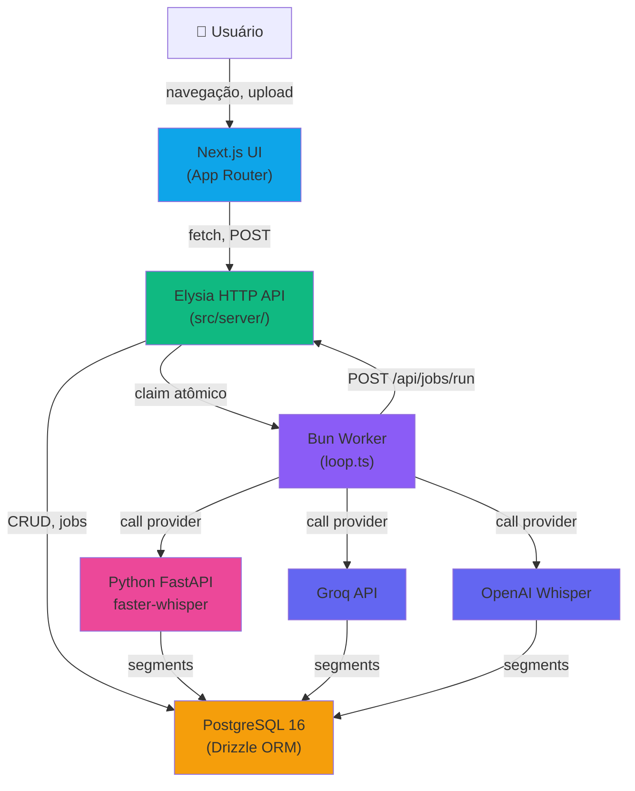
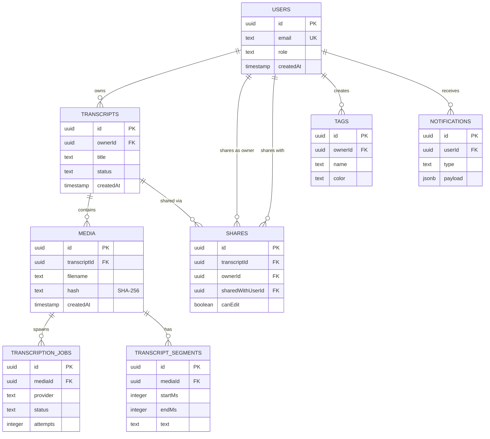
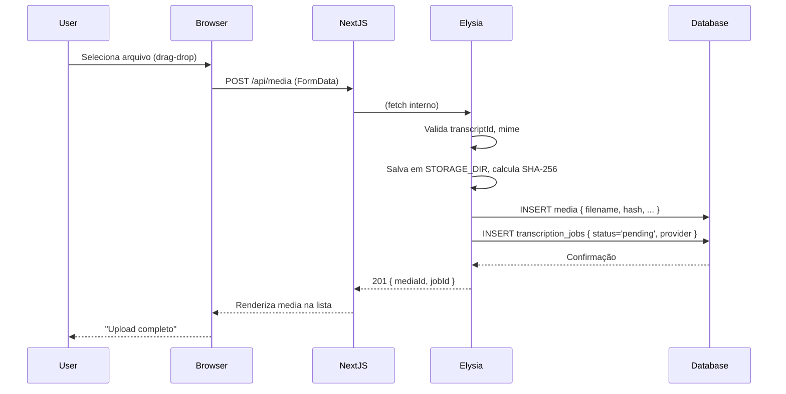
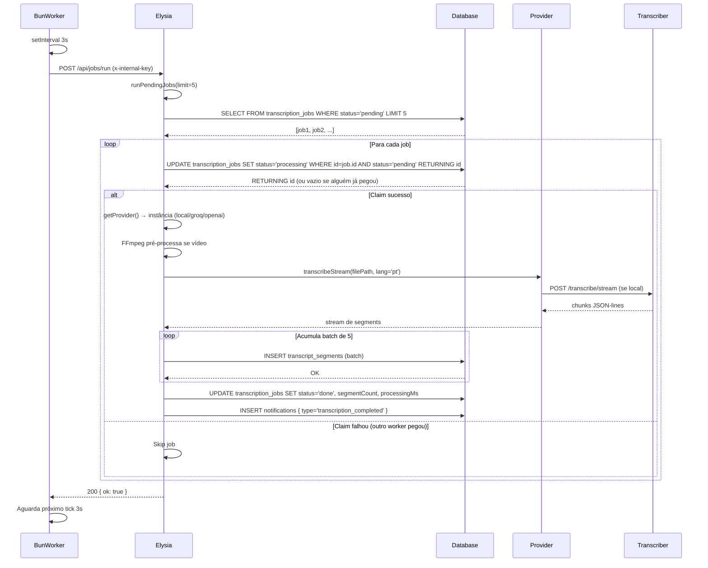
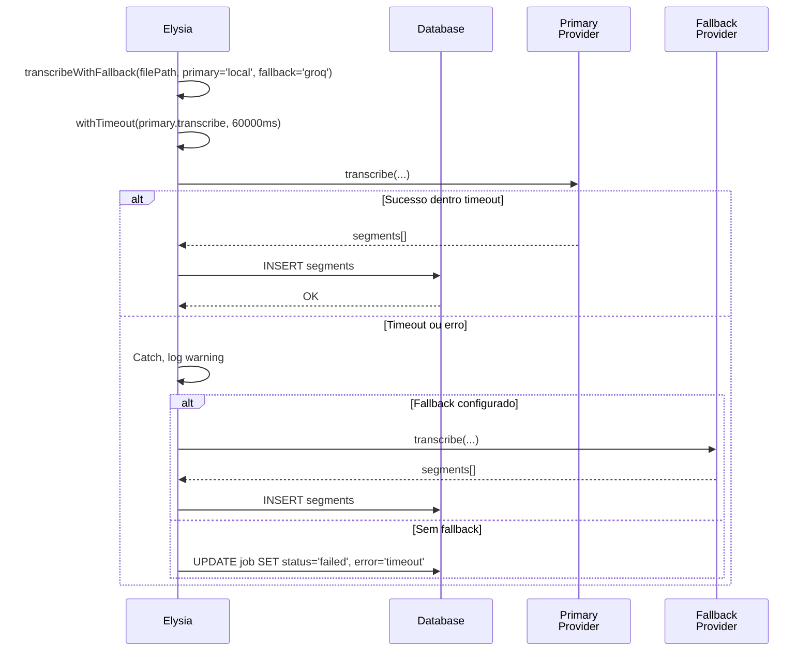
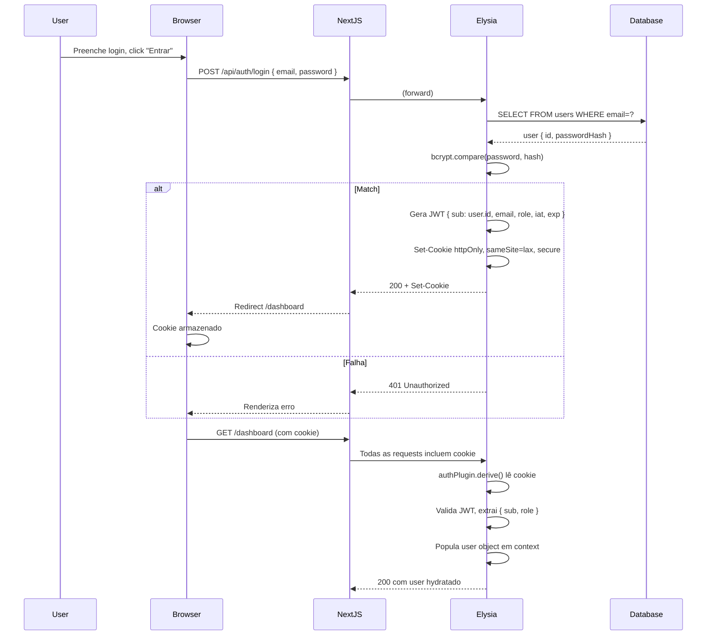
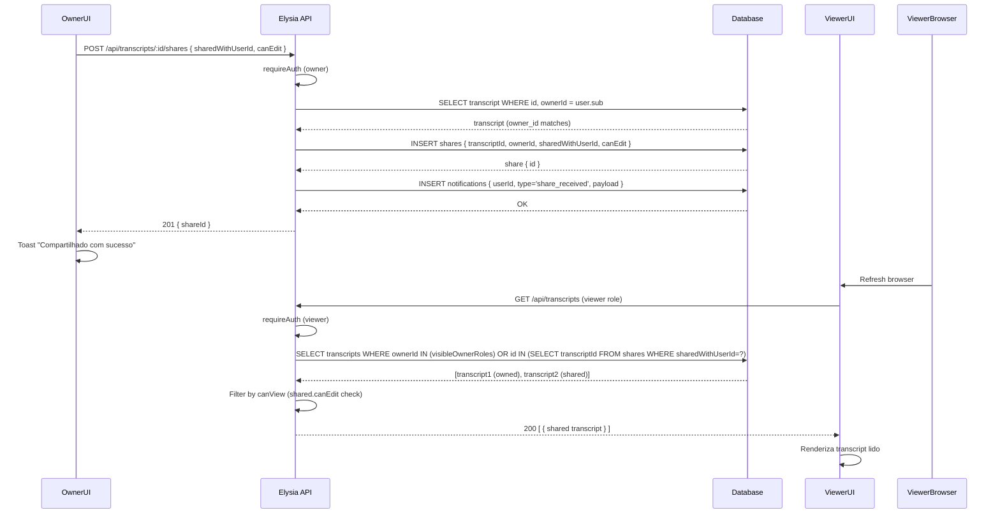

# Software Design Document (SDD)

**Transcripts** — SaaS de transcrição de mídia (áudio/vídeo) com dashboard web editável.

---

## 1. Visão Geral

Transcripts é um sistema fullstack para upload, transcrição e edição de mídia (áudio/vídeo) em português. Arquitetura em **5 processos independentes em um repositório**:

1. **Next.js 16 (App Router)** — UI em `src/app/`
2. **Elysia HTTP API** — API REST em `src/server/index.ts` (prefix `/api`), montada via catch-all Next.js em `src/app/api/[...path]/route.ts`
3. **PostgreSQL 16** — Banco de dados via Drizzle ORM (`src/db/schema.ts`)
4. **Bun Worker** — Loop assíncrono `src/workers/loop.ts` que chama POST `/api/jobs/run` a cada `WORKER_INTERVAL_MS` (padrão 3000ms = 3s)
5. **Transcriber Python** — FastAPI + faster-whisper em container separado (porta `:8000`), ativo quando `TRANSCRIPTION_PROVIDER=local`

---

## 2. Arquitetura Lógica



### Fluxo Principal (Upload → Transcrição → Notificação)

1. **Upload**: Usuário submete mídia via `POST /api/media` (formulário multipart) → servidor valida, salva em `STORAGE_DIR` via `LocalStorageService`, calcula SHA-256 e escreve em `media.hash`
2. **Job Creation**: API cria record `transcription_jobs` com status `pending` + `media` com referência `transcriptId`
3. **Worker Tick**: Worker (`src/workers/loop.ts`) chama `POST /api/jobs/run` com header `x-internal-key: $INTERNAL_API_KEY` a cada 3 segundos
4. **Processing** (`src/server/services/jobs.ts` → `runPendingJobs()`):
   - **Claim atômico**: `UPDATE transcription_jobs SET status='processing' WHERE id=? AND status='pending' RETURNING id` — apenas um worker consegue claims (evita corrida)
   - **FFmpeg pré-processa** (se vídeo): video → MP3 16kHz mono com `ffmpeg -i input.mp4 -ac 1 -ar 16000 output.mp3`
   - **Provider selection**: `getProvider()` retorna instância baseada em `TRANSCRIPTION_PROVIDER` env
   - **Streaming segments**: para cada segmento recebido (ex: `{ start_ms: 0, end_ms: 1500, text: "..." }`), acumula em batch de 5 e insere via `db.insert(transcriptSegments).values(batch)`
   - **Cleanup idempotente**: antes de inserir, `DELETE FROM transcript_segments WHERE media_id=?` (evita duplicatas em retries)
   - **Mark done/failed**: job → `done` se sucesso ou `failed` após 3 tentativas (campo `attempts` incrementa)
5. **Notification**: Sistema cria `notifications` com tipo `transcription_completed` ou `transcription_failed`, userId do dono, payload com transcriptId/error

---

## 3. Arquitetura Física

### Componentes

| Serviço                 | Localização           | Runtime                       | Porta | Responsabilidade                         |
| ----------------------- | --------------------- | ----------------------------- | ----- | ---------------------------------------- |
| **Next.js**             | `src/app/`            | Bun (turbopack)               | 3000  | UI (pages, layouts, components)          |
| **Elysia API**          | `src/server/index.ts` | Bun (montado em Next.js)      | —     | REST endpoints (prefix `/api`)           |
| **PostgreSQL**          | Docker                | postgres:16-alpine            | 5432  | Persistência (Drizzle schema)            |
| **Bun Worker**          | `src/workers/loop.ts` | Bun                           | —     | Loop assíncrono (POST tick a cada 3s)   |
| **Transcriber**         | `transcriber/main.py` | FastAPI + faster-whisper      | 8000  | Processamento Whisper (provider=local)   |
| **PgAdmin** (dev only)  | Docker                | pgadmin:latest                | 5050  | UI de gerenciamento DB                   |

### Docker Compose Stack

```yaml
# docker-compose.yml (prod default)
services:
  db:           # PostgreSQL 16-alpine, volume persistente, healthcheck pg_isready
  migrate:      # One-shot Drizzle (depends_on: db ready)
  transcriber:  # FastAPI :8000 (depends_on: migrate ready)
  app:          # Next.js + Elysia :3000 (depends_on: transcriber ready)
  worker:       # Bun worker loop (depends_on: app ready, background)

# Variantes
docker-compose.yml                # Prod padrão (sem pgadmin)
docker-compose.local.yml          # Dev com pgadmin :5050 e volumes locais
docker-compose-easypanel.yml      # Easypanel (usa SERVICE_FQDN_*, SERVICE_USER_*, SERVICE_PASSWORD_*)
docker-compose-coolify.yml        # Coolify VPS (expose não ports, SERVICE_* autogerados)
```

**Healthcheck Chain**:

```
db (pg_isready)  →  migrate (1 shot)  →  transcriber (GET /health)
                                          ↓
                                      app (GET /api/health)
                                          ↓
                                      worker (background, no probe)
```

---

## 4. Camadas de Arquitetura

### Layer 1: UI (Next.js App Router)
- **Localização**: `src/app/`
- **Componentes**: Server Components por padrão; `"use client"` apenas com estado/efeitos/browser APIs
- **ShadCN/UI**: new-york theme, composição completa (`CardHeader`, `CardContent`, `Dialog`, etc.)
- **Tailwind v4**: tokens semânticos (`bg-background`, `text-muted-foreground`, `border-border` — nunca hardcode `bg-blue-500`)
- **Rotas**: grupos `(auth)` (login/signup) e `(app)` (dashboard, transcripts, admin)
- **Auth**: Middleware lê cookie JWT → hydrata `user` object globalmente

### Layer 2: API (Elysia HTTP)
- **Localização**: `src/server/index.ts` (registra rotas), `src/server/routes/*` (10 arquivos)
- **Validação**: Zod 4 para body/params/query/response schemas
- **Auth macros**: `.macro(requireAuth)` / `.macro(requireAdmin)` aplicadas em handlers
- **Status codes**: 200/201/400/401/403/404/500 conforme padrão REST
- **Rotas registradas**: `healthRoutes`, `authRoutes`, `transcriptsRoutes`, `mediaRoutes`, `sharesRoutes`, `notificationsRoutes`, `usersRoutes`, `jobsRoutes`, `tagsRoutes`
- **Plugins**: `cors()`, `errorPlugin`, `authPlugin` (via `.use()`)

### Layer 3: Domain Logic (Services)
- **Localização**: `src/server/services/` (7 arquivos: `export.ts`, `jobs.ts`, `notification.ts`, `share.ts`, `storage.ts`, `transcription.ts`, `user.ts`)
- **Job orchestration**: `runPendingJobs()` em `jobs.ts` — claim atômico, retry logic, provider selection
- **Export generation**: `buildExport()` em `export.ts` produz txt/html/doc/docx com SHA-256 hashes
- **Transcription**: `transcribeAudio()` em `transcription.ts` — fallback provider, timeout, streaming

### Layer 4: Data (Drizzle ORM + PostgreSQL)
- **Localização**: `src/db/schema.ts` (9 tabelas + enums + relações), `src/db/client.ts` (instância Drizzle)
- **Migrations**: geradas via `drizzle-kit generate`, versionadas em `drizzle/`, aplicadas via one-shot container
- **Transactions**: `db.transaction()` para múltiplas alterações atômicas
- **DTOs**: tabelas nunca retornadas diretas; mapeadas para response shapes públicas

### Layer 5: Worker (Bun Loop)
- **Localização**: `src/workers/loop.ts`
- **Stateless**: não armazena estado em memória
- **Tick**: chama `POST /api/jobs/run` com `x-internal-key` a cada `WORKER_INTERVAL_MS`
- **Authentication**: header-only, sem JWT (internal API key)
- **Error handling**: log de falhas, retry automático em próximo tick

---

## 5. Modelo de Dados (Drizzle Schema)

### Tabelas e Enums

#### **Enums**

```typescript
userRoleEnum: "super_admin" | "admin" | "pro" | "viewer"
transcriptStatusEnum: "pending" | "processing" | "done" | "failed"
jobStatusEnum: "pending" | "processing" | "done" | "failed"
```

#### **`users`** (Identity & Auth)

```
id (UUID, PK)
email (TEXT, UNIQUE)
passwordHash (TEXT, nullable)
name (TEXT, nullable)
avatarUrl (TEXT, nullable)
role (userRoleEnum, default: "viewer")
createdAt, updatedAt (TIMESTAMP)
```

**Relações**: `many(transcripts)`, `many(shares as owner)`, `many(shares as sharedWith)`, `many(notifications)`

#### **`transcripts`** (Container de Mídia)

```
id (UUID, PK)
ownerId (UUID, FK → users.id, CASCADE)
title (TEXT)
operationName (TEXT) — contexto (ex: "reunião 2025-02-15")
operationDate (TIMESTAMP, nullable)
transcriptionDate (TIMESTAMP, nullable)
analysis (TEXT, nullable) — análise/summary editada
transcriptHtml (TEXT, nullable) — HTML editável
status (transcriptStatusEnum, default: "pending")
position (INTEGER, default: 0) — ordem na UI
deletedAt (TIMESTAMP, nullable) — soft delete
createdAt, updatedAt (TIMESTAMP)
```

**Relações**: `one(users)`, `many(media)`, `many(shares)`

#### **`media`** (Arquivos Áudio/Vídeo)

```
id (UUID, PK)
transcriptId (UUID, FK → transcripts.id, CASCADE)
filename (TEXT) — nome original (ex: "meeting.mp4")
mime (TEXT) — MIME type (ex: "video/mp4", "audio/mpeg")
sizeBytes (INTEGER, nullable)
storagePath (TEXT, nullable) — caminho relativo em STORAGE_DIR
durationSeconds (REAL, nullable)
description (TEXT, nullable)
transcriptHtml (TEXT, nullable) — HTML editável desta mídia
hash (TEXT, nullable) — SHA-256 do arquivo (migração 0008_add_media_hash.sql)
createdAt (TIMESTAMP)
```

**Relações**: `one(transcripts)`, `many(transcriptionJobs)`, `many(transcriptSegments)`

#### **`transcription_jobs`** (Processamento Assíncrono)

```
id (UUID, PK)
mediaId (UUID, FK → media.id, CASCADE)
provider (TEXT) — "local" | "groq" | "openai"
status (jobStatusEnum, default: "pending")
attempts (INTEGER, default: 0) — contador retries (0-3)
error (TEXT, nullable) — mensagem erro se falhar
segmentCount (INTEGER, default: 0) — quantidade segments inseridos
processingMs (INTEGER, nullable) — tempo total (ms)
startedAt (TIMESTAMP, nullable)
finishedAt (TIMESTAMP, nullable)
createdAt (TIMESTAMP)
```

**Relações**: `one(media)`

#### **`transcript_segments`** (Dados de Transcrição)

```
id (UUID, PK)
mediaId (UUID, FK → media.id, CASCADE)
startMs (INTEGER) — início em milissegundos
endMs (INTEGER) — fim em milissegundos
text (TEXT) — conteúdo do segmento
```

**Relações**: `one(media)`

#### **`shares`** (Compartilhamento Entre Usuários)

```
id (UUID, PK)
transcriptId (UUID, FK → transcripts.id, CASCADE)
ownerId (UUID, FK → users.id, CASCADE) — quem compartilhou
sharedWithUserId (UUID, FK → users.id, CASCADE) — com quem compartilhou
canEdit (BOOLEAN, default: true) — permissão de escrita
createdAt (TIMESTAMP)
UNIQUE INDEX (transcriptId, sharedWithUserId) — uma share por par
```

**Relações**: `one(transcripts)`, `one(users as owner)`, `one(users as sharedWith)`

#### **`tags`** (Categorização)

```
id (UUID, PK)
ownerId (UUID, FK → users.id, CASCADE)
name (TEXT)
color (TEXT, default: "#6366f1") — cor HEX
createdAt (TIMESTAMP)
UNIQUE INDEX (ownerId, name) — uma tag por nome por usuário
```

#### **`notifications`** (Sistema de Eventos)

```
id (UUID, PK)
userId (UUID, FK → users.id, CASCADE)
type (TEXT) — "transcription_completed" | "transcription_failed" | "share_received"
payload (JSONB, nullable) — dados contextuais
readAt (TIMESTAMP, nullable) — null = unread
createdAt (TIMESTAMP)
```

**Relações**: `one(users)`

### ER Diagram



---

## 6. Fluxos Principais (Sequence Diagrams)

### Fluxo 1: Upload e Criação de Job



### Fluxo 2: Worker Processamento com Claim Atômico



### Fluxo 3: Retry com Fallback e Timeout



### Fluxo 4: Autenticação com JWT e Cookie



### Fluxo 5: Compartilhamento de Transcript com Permissões



---

## 7. Decisões de Design (ADRs)

### ADR-1: Elysia em Catch-all Next.js

**Status**: Aceito

**Contexto**: Necessidade de montar API HTTP sem container separado.

**Decisão**: API REST rodada via Elysia dentro do Next.js através de `src/app/api/[...path]/route.ts`.

**Razão**:
- **Unificação**: Um único processo Node.js (Bun) executa UI + API.
- **Dev DX**: `bun run dev` sobe turbopack + API concomitantemente.
- **Deploy**: Mesmo container, mesmo Dockerfile, volume único para uploads.

**Trade-offs**:
- Coupling UI ↔ API (mitigado por isolamento de rotas em `src/server/routes/*`)
- Single failure domain (mitigado por healthchecks e separação de concerns)

**Alternativas rejeitadas**:
- Microserviços (API separada) → complexity não compensada neste estágio

---

### ADR-2: Drizzle ORM ao invés de Prisma

**Status**: Aceito

**Contexto**: Escolha de ORM para PostgreSQL.

**Decisão**: Drizzle para gerenciar schema e queries.

**Razão**:
- **Type Safety**: Schema em TypeScript (`src/db/schema.ts`), relações explícitas via `relations()`.
- **Controle**: Migrations via `drizzle-kit generate`, versionadas em `drizzle/`, sem runtime magic.
- **Performance**: Query builder nativo, sem tradução IR.
- **Observabilidade**: Schema e migrations legíveis e debugáveis.

**Trade-offs**:
- Menos abstrações que Prisma → queries complexas requerem SQL manual
- Comunidade menor

**Comparação Prisma**:
- Prisma: abstrato, schemas em DSL, gerenciamento automático
- Drizzle: explícito, schema em TS, full control

---

### ADR-3: Worker Stateless, Sem Fila Externa

**Status**: Aceito

**Contexto**: Orquestração de jobs de transcrição.

**Decisão**: Worker Bun (`src/workers/loop.ts`) é stateless. Chama POST `/api/jobs/run` a cada 3s. Sem Redis, Bull, ou RabbitMQ.

**Razão**:
- **Simplicidade**: SQL do banco já é fila (`transcription_jobs.status`).
- **Cost**: Sem infra adicional.
- **Observabilidade**: Jobs sempre visíveis em tabela.
- **Escalabilidade incremental**: Múltiplos workers via load-balancer sem mudança de código.

**Claim Atômico** (anti-corrida):
```sql
UPDATE transcription_jobs SET status='processing' 
WHERE id=? AND status='pending' 
RETURNING id
```
Apenas um worker consegue claim mesmo com múltiplas instâncias rodando.

**Retry Idempotente** (anti-duplicata):
```sql
DELETE FROM transcript_segments WHERE media_id=?
```
Executa antes de inserir segmentos para limpar dados de retries anteriores.

**Limites atuais**:
- Retry até 3x antes de marcar `failed`
- FIFO, limit 5 jobs por tick (parametrizável)
- Sem priorização

**Trade-offs**:
- Polling a cada 3s vs push-based (futuro: webhooks)
- Sem observabilidade nativa (futuro: Prometheus/StatsD)

---

### ADR-4: Bun Runtime

**Status**: Aceito

**Contexto**: Escolha de runtime JavaScript.

**Decisão**: **Bun** ao invés de Node.js.

**Razão**:
- **Performance**: ~3x mais rápido em startup e bundling.
- **DX**: `bun install`, `bun run dev`, `bun run worker:loop` — sem npm/yarn overhead.
- **Native support**: esbuild, PostgreSQL driver, TypeScript runtime.
- **Type safety**: TypeScript nativo sem `tsx` ou `ts-node`.

**Trade-offs**:
- Ecossistema menor que Node.js
- Algumas libs still Node.js-only (mitigado via compatibility layer)

---

### ADR-5: Transcriber Python Separado em Container

**Status**: Aceito

**Contexto**: Processamento Whisper.

**Decisão**: FastAPI + faster-whisper roda em container separado (`:8000`), chamado via HTTP de Bun.

**Razão**:
- **Isolamento**: Python deps não poluem Bun environment.
- **Escalabilidade**: Container pode usar multi-threading (GIL mitigation).
- **Flexibility**: Swap provider em `transcriber/main.py` sem rebuild Next.js.
- **Cache volumes**: Modelos Whisper em volume persistente (`whisper_cache`).

**Configuração**:
- Build-arg `WHISPER_MODEL`: `tiny` (VPS ARM 4GB) vs `base` (dev)
- `PRE_BAKE_MODEL=true`: embute modelo na imagem para cold-boot resiliente

**Trade-offs**:
- Network I/O entre Bun e Python
- Overhead de container

---

### ADR-6: Export Server-Side (txt/html/doc/docx)

**Status**: Aceito

**Contexto**: Exportação de transcrições.

**Decisão**: Geração server-side por `src/server/services/export.ts` (endpoint `GET /api/transcripts/:id/export?format=…`).

**Razão**:
- **Consistência**: Mesmo conteúdo (transcrição + segmentos + metadados + SHA-256) em todos os formatos.
- **Segurança**: Validação de permissões no servidor antes de exportar.
- **Auditoria**: Inclui `media.hash` em cada documento para integridade.

**Lib única**: `docx@^9.6.1` gera `.docx`/`.doc`; HTML/TXT montados via `buildHtml()`.

**Trade-offs**:
- Geração síncrona pode demorar em transcrições longas (mitigação futura: streaming)

---

### ADR-7: Hash SHA-256 em `media.hash`

**Status**: Aceito

**Contexto**: Integridade de arquivos.

**Decisão**: Cada upload calcula SHA-256 ao salvar em `STORAGE_DIR` e persiste em `media.hash` (migração `drizzle/0008_add_media_hash.sql`).

**Razão**:
- **Integridade**: Identifica corrupção / re-upload acidental.
- **Dedup**: Base para detectar mídias iguais.
- **Auditoria**: Hash incluído em todos os documentos exportados.

**Estado legado**: Coluna NULL-able para mídias antigas. Backfill batch via `bun run src/scripts/backfill-media-hash.ts`.

---

### ADR-8: Role-Based Transcript Permissions (T6 Hierarchy)

**Status**: Aceito

**Contexto**: Controle de acesso a transcrições.

**Decisão**: Hierarquia `super_admin > admin > pro > viewer` governa acesso com regras **assimétricas** para deleção.

**Regras (Genéricas)**:
- Mesmo tier → view-only
- Tier inferior → CRUD completo
- Tier superior → bloqueado
- Viewer → read-only global (próprio + shares)

**Regra Especial (Deleção)**:
- `canDeleteTranscript`: Super_admin tem privilégio **irrestrito** sobre qualquer transcript alheio (sem depender de rank).
  ```typescript
  if (actor.role === "super_admin") return true;  // Sempre pode deletar
  if (actor.id === owner.id) return true;         // Dono sempre pode
  return roleRank(actor.role) > roleRank(owner.role);  // Tier inferior pode
  ```
- **Justificativa**: Necessidade de moderação e cleanup cross-account por administradores.
- **Contraste**: `canEditTranscript` e `canViewTranscript` mantêm regra simétrica `roleRank(actor) > roleRank(owner)` (sem privilégio super_admin estendido).

**Rank**:
- super_admin = 4
- admin = 3
- pro = 2
- viewer = 1

**Razão**:
- **Modelo simples**: Rank numérico (`roleRank`) elimina ifs aninhados.
- **Centralizado**: Helpers em `src/lib/permissions.ts` reutilizados em rotas e UI.
- **Compat shares**: `shares.canEdit` governa override cross-tier.
- **Moderação assimétrica**: super_admin não precisa ser dono para deletar (cleanup/compliance).

**Aplicação**:
- `src/lib/permissions.ts`: `canViewTranscript()`, `canEditTranscript()`, `canDeleteTranscript()`
- `routes/transcripts.ts`: GET filtra por `visibleOwnerRoles`; PATCH/DELETE via `canEdit/canDelete`
- `routes/media.ts`: POST/PATCH/DELETE via `canEdit` (herdado de transcript)
- `routes/shares.ts`: POST/GET/PATCH/DELETE condicionados a `canEditTranscript`
- UI: hook `useActorRole` (`src/lib/use-actor-role.ts`)

**Trade-offs**:
- `GET /transcripts` para admins pode incluir transcrições alheias (cost `IN (...)` proporcional a visibleOwnerIds)
- Super_admin pode deletar transcripts sem consentimento do dono (feature, não bug)

---

## 8. Autenticação & Autorização

### JWT Payload

```typescript
{
  sub: user.id,        // SEMPRE use sub, NUNCA id
  email: user.email,
  role: user.role,     // "super_admin" | "admin" | "pro" | "viewer"
  iat: timestamp,
  exp: timestamp,
}
```

### Auth Flow

```
1. Login: POST /api/auth/login { email, password }
   → Valida via bcrypt, gera JWT, Set-Cookie httpOnly

2. Middleware: authPlugin.derive() extrai cookie → user object

3. Route Protection:
   - .macro(requireAuth) → 401 se user === null
   - .macro(requireAdmin) → 403 se user.role não é admin+
   - Manual checks: if (user?.id !== ownerId) throw 403

4. Refresh: Automático via refresh_token antes de exp (future)
```

### Status Codes

- **401 Unauthorized**: Token inválido/expirado
- **403 Forbidden**: User autenticado mas sem permissão

---

## 9. Validação & Error Handling

### Zod 4 Validation

Schemas centralizados em `src/lib/zod.ts`, aplicados em handlers via `.guard()`:

```typescript
app.post(
  "/transcripts",
  ({ body, user }) => {
    // Zod valida automaticamente
    // Retorna 422 se schema falhar
  },
  { body: CreateTranscriptSchema }
);
```

### Job Retries

```typescript
if (job.attempts < 3) {
  // Re-insert com status pending
  await db.update(transcriptionJobs).set({
    status: "pending",
    attempts: job.attempts + 1,
  });
} else {
  // Esgotadas retentativas
  await db.update(transcriptionJobs).set({
    status: "failed",
    error: err.message,
    finishedAt: new Date(),
  });
  // Notifica usuário
}
```

### Timeout

```typescript
const timeoutMs = Number(process.env.TRANSCRIBER_TIMEOUT_MS ?? 60000);
const withTimeout = (promise) =>
  Promise.race([
    promise,
    new Promise((_, rej) =>
      setTimeout(() => rej(new Error("transcriber_timeout")), timeoutMs)
    ),
  ]);
```

### Fallback Provider

```typescript
try {
  return await withTimeout(primary.transcribe(filePath, lang));
} catch (err) {
  if (!fallback || fallback === primary.name) throw err;
  console.warn(`[transcription] primary failed; falling back to ${fallback}`);
  const provider = createProvider(fallback);
  return provider.transcribe(filePath, lang);
}
```

### Storage Cleanup

Se job falhar, arquivos **não são deletados** automaticamente (para debug/retry). Cleanup manual via admin endpoint (future).

---

## 10. Observabilidade

### Logging

Padrão: `[module] message`

```
[worker] starting loop interval=3000ms
[jobs] mediaId=..., provider=local, segments=125, ms=45000
[authPlugin] user=..., session=...
[transcription] primary=local failed; falling back to groq
```

Controlado por:
```env
AUTH_DEBUG=1     # Log detalhado auth
LOG_LEVEL=INFO   # INFO | DEBUG | ERROR
```

### Health Checks

```
GET /api/health → { status: "ok" } 200
GET /transcriber:8000/health → { status: "ready" } 200
```

### Métricas (Future)

- Jobs por minuto (throughput)
- Error rate (failed jobs %)
- Latência média por provider
- Storage utilização

---

## 11. Transações & Atomicidade

### Multi-Table Atomic Writes

Quando uma regra altera múltiplas tabelas, usar `db.transaction()`:

```typescript
await db.transaction(async (tx) => {
  await tx.insert(transcripts).values(newTranscript);
  await tx.insert(media).values(newMedia);
  await tx.insert(transcriptionJobs).values(newJob);
});
```

Se qualquer operação falhar, tudo faz rollback.

### Job Claim (Exactly-Once)

```sql
UPDATE transcription_jobs SET status='processing' 
WHERE id=? AND status='pending' 
RETURNING id
```

Retorna vazio se job já foi claimed por outro worker → skip.

---

## 12. Escalabilidade & Roadmap

### Phase 1 (Atual)

- Single-container Elysia + Next.js
- Bun worker stateless, polling 3s
- PostgreSQL local ou RDS
- Transcriber Python container
- Local filesystem storage

### Phase 2 (Escalabilidade Horizontal)

- Múltiplos workers via load-balancer ou Kubernetes
- Redis cache para sessões + job distribution
- S3/cloud storage (não local STORAGE_DIR)
- Webhook notifications ao invés de polling
- Message queue (SQS/Kafka) ao invés de DB polling

### Phase 3 (Multitenancy)

- Organização + workspace
- Row-level security (RLS) no Postgres
- Tenant isolation em storage paths
- Per-tenant billing

---

## 13. Pontos de Extensão

### Novos Providers de Transcrição

Implementar interface em `src/server/services/transcription.ts`:

```typescript
interface TranscriptionProvider {
  transcribe(filePath, lang): Promise<Segment[]>;
  transcribeStream(filePath, lang): AsyncIterator<Segment>;
}
```

Registrar em `getProvider()`.

### Novos Tipos de Notificação

Estender enum `NOTIFICATION_TYPES` em `src/server/services/notification.ts`, criar handlers em `routes/notifications.ts`.

### Novos Formatos de Export

Adicionar função em `src/server/services/export.ts` → gerar novo `content` baseado no array `segments + metadata`, registrar route handler em `routes/transcripts.ts` com `?format=novo`.

### Custom Storage Backend

Implementar interface `StorageService` em `src/server/services/storage.ts`, trocar `LocalStorageService` por S3/GCS.

---

## 14. Resumo Comparativo de Decisões

| Aspecto              | Escolha                       | Razão                                    |
| -------------------- | ----------------------------- | ---------------------------------------- |
| **Runtime**          | Bun                           | Perf, DX, type safety nativo             |
| **UI Framework**     | Next.js 16 + App Router       | SSR, routing automático, ShadCN native   |
| **API HTTP**         | Elysia (catch-all Next.js)    | Unificação, dev simplificado             |
| **ORM**              | Drizzle                       | Type safety, full control, migrations    |
| **DB**               | PostgreSQL 16                 | ACID, JSON, relational, maturidade       |
| **Auth**             | JWT + cookie httpOnly         | Stateless, secure, HTTP-only             |
| **Job Queue**        | Banco de dados (polling)      | Sem infra, suficiente para escala atual  |
| **Transcriber**      | Python (container)            | Isolamento, GPU support (future)         |
| **UI Components**    | ShadCN/UI new-york            | Type-safe, customizável, Tailwind nativo |
| **Validation**       | Zod 4                         | Type inference, runtime safety          |
| **Permissions**      | Role-based hierarchy (T6)     | Modelo simples, centralizado             |
| **Export**           | Server-side (txt/html/docx)   | Consistência, auditoria SHA-256          |
| **Hash Integridade** | SHA-256 em media.hash         | Dedup, auditoria, integridade            |

---

## 15. Referências

- **Next.js 16**: https://nextjs.org/docs
- **Elysia**: https://elysiajs.com/
- **Drizzle ORM**: https://orm.drizzle.team/
- **Bun**: https://bun.sh/
- **Zod 4**: https://zod.dev/
- **Tailwind CSS v4**: https://tailwindcss.com/
- **ShadCN/UI**: https://ui.shadcn.com/
- **Faster-Whisper**: https://github.com/SYSTRAN/faster-whisper
- **Groq API**: https://console.groq.com/
- **OpenAI Whisper API**: https://platform.openai.com/docs/api-reference/audio
- **PostgreSQL 16**: https://www.postgresql.org/docs/16/
